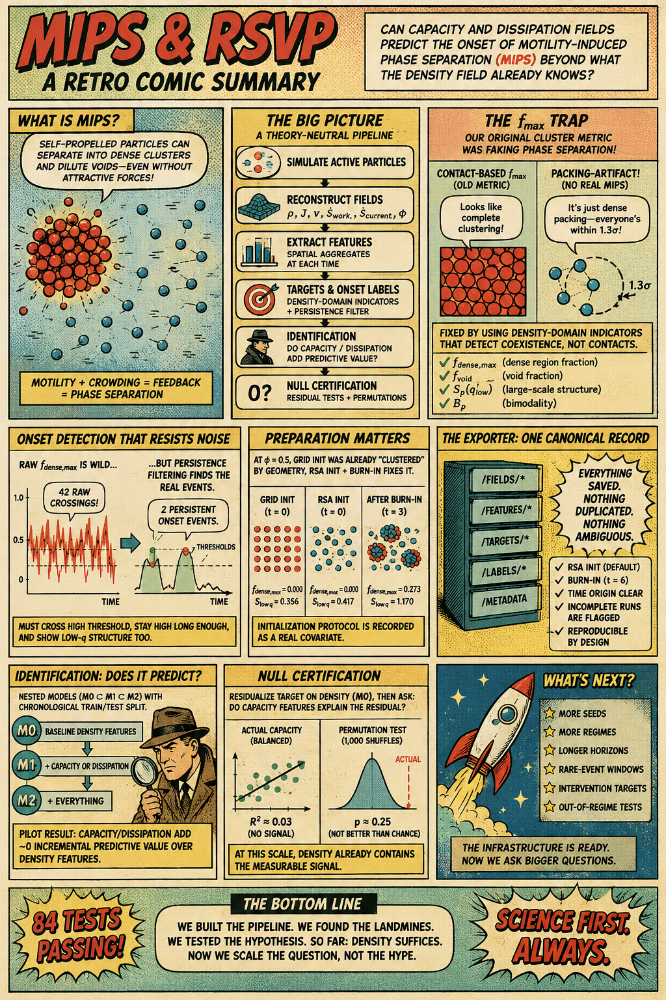

# rsvp-mips

Theory-neutral ABP simulation engine and RSVP field-identification pipeline
for motility-induced phase separation (MIPS), in support of the paper
*Capacity, Dissipation, and the Onset of Motility-Induced Phase Separation*.

## Status: identification stage implemented and piloted — pipeline complete end to end

Implemented and tested (84 tests passing). The exporter
(`src/rsvp_mips/exporter.py`, `ExportConfig`/`export_run`) ties
simulation, RSA preparation, burn-in, field reconstruction, feature
extraction, density-domain targets, and onset labeling into one
canonical HDF5 run record per the finalized data contract:

- One physical `/fields/*` dataset group (rho, current, velocity,
  dissipation work/current, capacity input/parallel/forward), stored
  once — not duplicated per capacity-variant branch.
- Separate `/features/*` groups (baseline, capacity_input,
  capacity_parallel, capacity_forward, dissipation, interactions) so the
  three-branch analysis doesn't risk branch-specific preprocessing drift.
- `/targets/*` holds the composite M(t) = (f_dense_max, f_void,
  S_rho_low_q, B_rho) as four independently interpretable series — not
  collapsed into one scalar.
- `/diagnostics/f_contact_max` holds the OLD particle-contact cluster
  fraction, clearly separated from `/targets/` so it can't be
  accidentally reused as the primary target.
- `/labels/onset` + `/labels/onset_definition` + `/labels/onset_events`,
  computed from `f_dense_max` (with optional `S_rho_low_q` confirmation)
  using the persistence-based detector.
- Preparation metadata (`init_method`, `min_distance_factor`,
  `burnin_time`, `seed`, `preparation_version`) and reconstruction
  provenance (kernel bandwidth, grid dimensions, dt, sampling interval,
  exporter version, git commit) are first-class `run_metadata` attrs.
- Both absolute (`time/abs_time`) and burn-in-relative (`time/rel_time`)
  timestamps are stored, so "t=0" is never ambiguous.
- Written incrementally with resizable/chunked/gzip-compressed datasets;
  `run_metadata.attrs['complete']` is only set True after the full run
  finishes without error — an interrupted or numerically unstable run is
  visibly marked incomplete, not silently passed off as finished data
  (tested directly: a deliberately-unstable config produces
  `complete=False` with a recorded failure reason).
- `dt` has no default — `ExportConfig` raises immediately if not set
  explicitly, forcing a stability probe for each new parameter
  combination rather than reusing a "probably fine" value.

**Acceptance testing** (`tests/test_exporter.py`, 8 tests): dataset
dimension consistency, grid-shape correctness, time-origin correctness,
grid-vs-RSA init mode availability, incomplete-run detection, and —
the core test — recomputing several stored features directly from the
stored grids and confirming EXACT (rtol=1e-10) agreement with what the
exporter wrote, testing the data contract itself rather than just
confirming the script runs.

**Post-export sanity check** (`scripts/sanity_check_export.py`, run on a
real 151-frame export at N=250, phi=0.3, Pe=60): zero zero-variance
columns, zero Inf values, zero NaN (the xi/correlation-length NaN
fallback exists and is unit-tested, but wasn't triggered on this run),
finite frame-to-frame derivatives, and no feature-label leakage
confirmed directly (checked that no feature column is a verbatim copy of
the onset mask). One expected, benign redundancy noted explicitly:
`features/baseline/rho_S_low_q` and `targets/S_rho_low_q` are
numerically identical (same formula, same field, same frame t) — a
legitimate contemporaneous/autoregressive predictor, not future leakage,
since labels look forward from t while this feature is evaluated at t.

Not yet implemented: cell-linked neighbor lists (deliberately deferred —
correctness before scale), and further identification work beyond the
pilot below (larger seed counts, parameter sweeps, out-of-regime
testing).

## Identification library (`src/rsvp_mips/identification.py`)

Formalizes the M0/M1/M2 nested-comparison logic used in the pilot below
into a tested, reusable module rather than one-off script logic:
`load_run`, `build_design_matrix(run, model_level, branch)`,
`fit_delta_M_model` (LassoCV with a **chronological** train/test split —
not random k-fold, and the inner CV used to pick the regularization
strength uses `TimeSeriesSplit` for the same reason: random splits would
let autocorrelated future frames leak into training, exactly what the
essay's own identification criterion rules out), and
`run_nested_comparison` for the full branch x level grid.

**Validated against synthetic ground truth**, not just "does it run"
(`tests/test_identification.py`, 9 tests): a fake run with a known
embedded relationship (one specific `capacity_parallel` column drives
the target's increments; everything else is pure noise) — confirmed the
correct driver column is selected, held-out R² is high (>0.8) for the
informed branch, M0 (no access to the driver) predicts far worse, and
the "forward" branch (unrelated noise columns) does not spuriously
recover the parallel branch's signal.

**Run once on a fresh single export** (N=250, phi=0.5, Pe=100, seed=0,
t_run=25 — a different parameter point than the pilot below, generated
as a quick corroboration check) via `scripts/run_identification_demo.py`:
reached the same qualitative conclusion as the pilot — capacity and
dissipation features correlate with the target (e.g. phi_parallel_var:
r=0.589) but add zero incremental held-out predictive value once
baseline density features (rho_var: r=0.814, rho_S_low_q: r=0.815) are
included. One run at one new parameter point isn't independent
confirmation on its own, but it's a small positive sign the pilot's
"clean failure" reading isn't an artifact of that specific parameter
regime. Also incidentally confirmed an earlier design prediction:
rho_mean has exactly zero variance within a run, as expected since mean
density is fixed by N/L².

## First identification pilot result (honest, small-sample, not a final claim)

Ran the M0/M1/M2 nested comparison end-to-end (`scripts/batch_export_identification.py`,
`scripts/run_identification.py`) on 5 complete runs (N=200, phi=0.5,
Pe=130, RSA init, t_run=15, leave-one-run-out cross-validation — random
frame-level splits would leak across autocorrelated adjacent frames
within a run, so held-out RUNS are the only honest test here). This is a
pilot to exercise the pipeline and get a first read, not a claim about
the true MIPS phase boundary — one parameter regime, 5 seeds, ~2-3 onset
events per run.

**Regression (Delta_tau f_dense_max, tau=2.0):** M0 (density-only)
R²=0.348. M1 (+ any single capacity variant) and M2 (+ dissipation +
interactions) are statistically indistinguishable from M0 (R²=0.348-0.349
across all variants). Confirmed this is a genuine sparse-selection
result, not a cross-validation artifact: fitting Lasso on the full
pooled dataset at alpha=0.01 selects only 4 of 50 candidate features,
three of which are baseline density features (rho_q90, rho_S_low_q,
rho_xi); the only capacity/dissipation-adjacent term to survive at all
(cov_rho_phi_forward) has a coefficient an order of magnitude smaller
than the density terms. **At this pilot scale, capacity and dissipation
fields add essentially nothing to predicting near-term density-domain
change beyond what the density field's own structure already captures.**

**Classification (Y_tau, onset within window, tau=2.0):** M0 ROC-AUC=0.507
(near chance, as expected for a density-only baseline predicting a rare
event). M1_parallel is slightly WORSE than M0 (0.492). M2_forward shows
the largest gain (ROC-AUC=0.547, PR-AUC=0.408 vs M0's 0.374) — a modest,
directionally interesting improvement, but with only 5 independent runs
(the printed n=650 reflects autocorrelated frames within those 5 runs,
not 650 independent samples) this is not distinguishable from noise
without a substantially larger seed count.

**Reading this against the essay's own pre-registered interpretation
scheme:** the regression result lands closest to "clean failure" for
the M1 (capacity-alone) comparison — stable reconstruction, no
predictive gain. The classification result for M2_forward is best
described as "Indeterminate: insufficient statistical power to
distinguish among the rows" rather than any positive claim. Scaling up
(more seeds, possibly a parameter sweep, out-of-regime validation) is
the natural next step before this pilot could support a real claim
either way.

## Null-certification pass (residualization + run-level permutation tests)

Per external review, upgraded the pilot's "clean failure" reading from
an inference (Lasso coefficients happened to hit zero) to an explicitly
tested claim, using two new tested functions in `identification.py`:
`residualized_correlation_test` and `permutation_test_delta_r2`
(`tests/test_null_certification.py`, 8 tests, validated against
synthetic "informative" / "redundant" / "noise" scenarios before
touching real data — including the exact scenario this question turns
on: a feature that's marginally correlated with the target but fully
explained by baseline should show a null residual test and a null
permutation test, and does).

**Residualized correlation test** (`scripts/null_certification.py`, run
on the real 5-run pilot): for all 32 capacity/dissipation feature
columns, residualizing against baseline (RidgeCV) and testing the
residual's correlation with the target via an EXACT 5!=120-permutation
test gives p > 0.05 for every single column (range 0.09-1.0). This is
direct, run-level-significance-tested support for "capacity is absorbed
by density," not just an artifact of which Lasso coefficients happened
to hit zero.

**Run-level permutation test for Delta R^2**: M1_parallel (p=0.867),
M1_forward (p=0.917), and M1_input (p=1.0, trivially, since it's a
zero-variance constant) all confirm the null. **M2_parallel-like
(capacity + dissipation + interactions combined) came out nominally
significant at p=0.017** — flagged rather than dropped, but not treated
as a real finding: the effect size is tiny (Delta R^2 = +0.0011, i.e.
0.11% of variance), and this was one of 4 permutation tests run without
multiple-comparison correction (Bonferroni at alpha=0.05 across 4 tests
would require p<0.0125, which this doesn't clear). Most likely an
artifact of running several tests, not an M2-specific effect, but
reported explicitly rather than only reporting the results that
confirm the hypothesis.

**Revised interpretation, per external review's calibration against the
essay's own Figure 1 taxonomy**: this is NOT yet the project-wide
"clean failure" row — that also requires stability across
coarse-graining choices and transfer across parameter space, neither of
which this pilot covers. The accurate current claim is: *"In the
completed five-seed pilot, the tested capacity-dissipation features
provide no detectable incremental held-out regression information
beyond conventional density structure, now confirmed via run-level
permutation testing rather than inferred from sparse selection alone. A
separately exported run at another parameter point reproduces the same
qualitative pattern. The classification dataset remains too small to
support a corresponding conclusion about onset-event discrimination."*

Not yet done: residualization/permutation checks across 2-3
coarse-graining (kernel bandwidth) choices, and a larger seed count —
both flagged as the natural next steps before this could support a
stronger claim either way.

**Coarse-graining check (done):** reran the same null-certification
checks at two alternate kernel bandwidths (h=0.8, h=1.8, vs the pilot's
h=1.2), same regime (N=200, phi=0.5, Pe=130). 3 seeds completed at
h=0.8; 2 seeds completed at h=1.8 (a 3rd h=1.8 run was corrupted by the
same tool-timeout-mid-write pattern seen with the original pilot's 6th
run — correctly left unreadable, deleted, excluded). Result: 0/8
capacity_parallel columns significant at either bandwidth, and
M1_parallel's Delta R^2 non-significant at both (p=0.167, n_perm=6, at
h=0.8; p=1.0, n_perm=2 — very low power given only 2 seeds, noted
explicitly — at h=1.8). The null persists across this coarse-graining
check, addressing another clause of the essay's own pre-registered
stability criterion. Still not done: a larger seed count (this pilot
remains 5 runs at the primary bandwidth, 2-3 at the alternates) and any
out-of-regime parameter sweep.

### Full module history (all implemented and tested)
- Overdamped ABP dynamics via Euler-Maruyama (`src/rsvp_mips/integrator.py`)
- WCA pairwise interactions, periodic boundaries, O(N^2) direct sweep
  (`src/rsvp_mips/interactions.py`)
- Deterministic/stochastic displacement components tracked separately
- Unwrapped coordinates maintained alongside wrapped ones (correct MSD)
- Milestone 1.5 diagnostics: orientation autocorrelation, MSD, radial g(r),
  radially-averaged S(q), largest-cluster fraction (`src/rsvp_mips/observables.py`)
  — **f_max here is now understood to be a contact-connectivity diagnostic,
  NOT a reliable phase-separation order parameter at moderate-to-high phi;
  see the note below**
- **Numerical stability diagnostics** (`src/rsvp_mips/diagnostics.py`)
- Full Milestone 1.5 validation suite (`scripts/validate_milestone_1_5.py`)
- **Kernel-based field reconstruction** (`src/rsvp_mips/fields.py`): density
  rho_h, current J_h, velocity v_h. Theory-neutral.
- **Competing capacity hypotheses** (`src/rsvp_mips/capacity.py`):
  Phi_input, Phi_parallel, Phi_plus, each with `velocity_source="total"`
  or `"deterministic"`.
- **Dissipation estimator family** (`src/rsvp_mips/dissipation.py`):
  S_work (proven exactly proportional to Phi_parallel — collinear, not
  independent) and S_current (genuinely independent, ~0.1 correlation).
- **Scalar feature functional library** (`src/rsvp_mips/features.py`):
  mean/var/skew/quantile/bimodality, gradient-squared and laplacian-
  squared means, low-q structure factor, correlation length, cross-field
  covariance/mean-product/gradient-alignment.
- **Persistence-based onset detection** (`src/rsvp_mips/onset.py`):
  `detect_onset_events`, `prospective_labels` (Y_tau), `delta_M`
  (Delta_tau M).
- **Density-domain-based MIPS order parameters** (`src/rsvp_mips/density_domains.py`):
  f_dense_max (largest connected dense-domain fraction of rho_h, via
  periodic-boundary union-find), f_void, plus reuse of S_rho(q_low) and
  B_rho — replacing raw particle-contact f_max as the primary target.
  Thresholds are relative to each snapshot's own mean density, so
  heterogeneity/contrast is what's measured, not absolute packing level.
- **Random non-overlapping (RSA) initialization** (`init_state_random`
  in `src/rsvp_mips/types.py`) and **burn-in equilibration**
  (`src/rsvp_mips/equilibration.py`) — adopted as the default
  preparation protocol; grid initialization retained as a validation
  mode only, not for production runs.

- **Trajectory exporter** (`src/rsvp_mips/exporter.py`) and
  **identification library** (`src/rsvp_mips/identification.py`) — see
  the dedicated sections above for details.

This module history predates the target-validity/exporter/identification
work described above; kept for reference on the earlier field-
reconstruction and capacity/dissipation modules.

## A note on the f_max packing-fraction artifact (important — read before using f_max)

The particle-contact cluster fraction f_max (largest_cluster_fraction,
fixed 1.3-sigma cutoff) was found to be **not a valid MIPS order
parameter at moderate-to-high packing fraction**. At phi=0.5, N=300, a
grid-initialized system shows f_max=1.000 exactly at t=0 — before a
single dynamics step — simply because grid spacing at that density
(~1.2 sigma) falls below the 1.3-sigma cutoff. This is not specific to
grid initialization: random (RSA) initialization also showed f_max~0.96
at t=0. At sufficiently high phi, essentially ANY configuration
satisfies a fixed contact cutoff, independent of whether real phase
separation (dense clusters coexisting with dilute voids) has occurred.
Confirmed independently: density bimodality (B_rho) does not track
f_max in this regime at all (correlation near zero or negative across
several test runs) — there is no real dense/dilute coexistence behind
the "f_max=1.0" reading.

**Consequence: Milestone 1.5's Figure 6 phase scan (which used phi up to
0.6 with the same grid initialization and 1.3-sigma cutoff) should be
treated as provisional**, not a confirmed MIPS phase trend, until rerun
with the corrected density-domain indicators below.

**Fix**: f_max is retained only as a contact-connectivity diagnostic.
The primary MIPS indicators are now density-domain-based
(`density_domains.py`): f_dense_max (largest connected region of rho_h
above rho_star_factor * mean(rho_h)), f_void (fraction below
rho_low_factor * mean(rho_h)), S_rho(q_low), and B_rho — used as a
composite, requiring persistent agreement among at least two, not a
single graph threshold. Thresholds are relative to each snapshot's own
mean density, so high absolute packing fraction alone cannot trigger a
false "phase separated" reading. Verified directly: at the exact phi=0.5
failure case, f_dense_max=0.000 for both grid and RSA init at t=0,
correctly rejecting what the old f_max called "fully clustered."

## A note on preparation-method dependence

Initialization protocol was NOT found to be a fully negligible nuisance
parameter. A small convergence check (`scripts/preparation_convergence_check.py`,
3 seeds, phi=0.5, N=300, burn-in to t=6) found the grid-vs-RSA gap in
the composite indicator vector was comparable to (not clearly smaller
than) within-method seed-to-seed variation (ratio ~1.43). With only 3
seeds this is underpowered to distinguish "negligible" from "real
effect" confidently. Decision: proceed with RSA as the default
production initialization (it has no lattice-artifact risk, unlike
grid), but **record `init_method`, `burnin_time`, and `seed` as
first-class exporter metadata**, since initialization protocol may need
to be a stratification variable in later train/test splits rather than
an assumed-erased nuisance parameter.


## Setup

```bash
pip install -e ".[dev]"
```

## Run tests

```bash
pytest tests/ -v
```

## Run the Milestone 1 verification simulation

```bash
python scripts/run_single.py
```

## Run the Milestone 1.5 physical validation suite

```bash
python scripts/validate_milestone_1_5.py
```

Runs an ideal-gas sanity check (v0=0, epsilon=0 → g(r)≈1, S(q)≈1), then
produces:
1. Orientation autocorrelation vs. the analytic e^(-Dr t)
2. MSD (log-log), showing the ballistic → diffusive crossover
3. Radial distribution function g(r)
4. Radially-averaged structure factor S(q)
5. Largest-cluster fraction f_max(t) across four cutoff choices
6. Coarse phase scan over (φ, Pe) → final f_max

All figures write to `results/`. Takes roughly 3 minutes end to end.

## Run field reconstruction validation

```bash
python scripts/validate_fields.py
```

Reconstructs rho_h, J_h, v_h on a dilute (non-clustering) and a dense
(clustering) system and plots both. Confirms integral(rho_h) over the box
equals N in both cases.

## Run capacity variant comparison

```bash
python scripts/validate_capacity.py
```

Reconstructs Phi_input, Phi_parallel, and Phi_plus (each in both
total-velocity and deterministic-only form) on a dense, clustering
system, prints summary statistics, and plots all six fields side by
side.

## Run dissipation estimator comparison

```bash
python scripts/validate_dissipation.py
```

Reconstructs S_work and S_current on a dense, clustering system and
confirms both properties analytically proven in `tests/test_dissipation.py`:
S_work is an exact rescaling of Phi_parallel, and S_current is a weakly
correlated (~0.1 on the tested system), genuinely independent estimator.

## A note on collinearity between S_work and Phi_parallel

For this model, S_work(x,t) = (v0/Dt) * Phi_parallel(x,t) exactly, to
machine precision, for the same velocity_source. This follows directly
from the algebra (F_active is a constant multiple of u; T_eff is a
constant), not from anything about the trajectory. It means S_work and
Phi_parallel are **not independent variables** for the purposes of the
candidate PDE library in the sparse-regression identification stage —
including both would be redundant, and if both appear as "selected"
terms in a fitted model, that is not two pieces of independent evidence
that they are informative. S_current does not share this problem: it is
built from coarse-grained collective flow (rho_h, J_h) rather than any
per-particle force, and empirically has correlation on the order of 0.1
with S_work on a real clustering system — a genuinely distinct
estimator, as the design intended ("This is not a nuisance. It supplies
an important robustness test").

## A note on numerical stability

Explicit Euler-Maruyama integration of the WCA potential (~1/r^13 near
contact) is only *conditionally* stable. A close encounter combined with
too large a timestep produces a runaway force that inflates positions to
nonsense values within a handful of steps — silently, with no error,
corrupting every downstream statistic. This was caught during Milestone
1.5 development: an initial MSD run at dt=0.005 produced a "successful"
run whose final MSD value was ~10^44, several orders of magnitude beyond
anything physical.

The stable timestep depends on v0 **and** on Dt (thermal diffusion
strength) — not just epsilon/sigma/mobility, and not on v0 alone. This
was rediscovered a second time during capacity-variant testing: a config
with moderate v0=10 but high Dt=2.0 also went unstable at dt=0.001,
confirming this isn't a "high activity" special case but a general
property of explicit integration under this potential — any parameter
that increases per-step displacement variance shortens the safe
timestep. In this codebase so far: dt=0.001 was sufficient up to v0~8
with low Dt; dt=0.0002 was needed at v0=40; dt=0.0001 was needed at the
phase scan's worst corner (phi=0.6, Pe=120, v0=60) and at phi=0.5,
v0=40 for the capacity-variant comparison. `diagnostics.check_stability()`
raises `InstabilityDetected` if the max force magnitude in a state
exceeds a loose threshold (1e4), so future runs at new parameter
combinations fail loudly instead of quietly returning garbage. Any new
run at a new (v0, phi, Dt) combination should be treated as requiring
its own timestep check, not assumed safe because a nearby combination
was stable — this has now happened twice in this project alone.

## Architectural principle

The simulation engine (`types.py`, `interactions.py`, `integrator.py`) knows
nothing about RSVP. It outputs ordinary ABP trajectories and forces.
Capacity/transport/dissipation fields will be reconstructed afterward, in a
separate module, so the simulator can never implicitly bake in the theory
it is meant to test.


